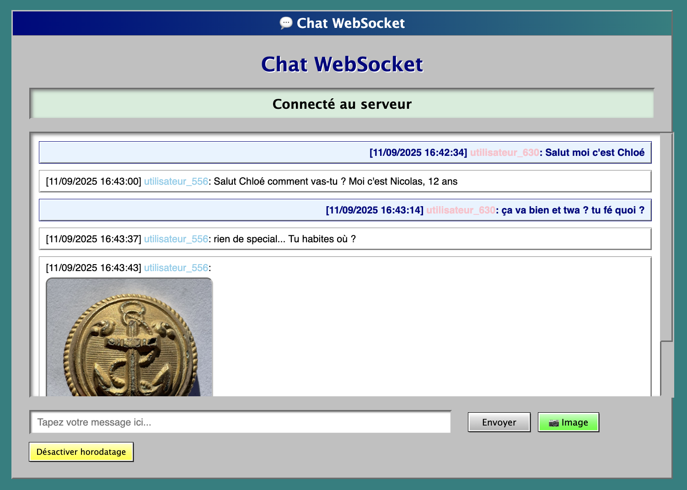

# Application Chat WebSocket

Cette application démontre un système de chat simple utilisant les WebSockets avec un serveur Node.js et un client HTML/JavaScript.



## Fonctionnalités

- **Serveur WebSocket** : Reçoit les messages des clients et les retransmet à tous les clients connectés (broadcast complet)
- **Client Web** : Interface simple pour envoyer et recevoir des messages en temps réel
- **Communication bidirectionnelle** : Les messages sont envoyés et reçus instantanément
- **Visibilité des messages** : Chaque utilisateur voit ses propres messages ainsi que ceux des autres
- **Horodatage automatique** : Chaque message est précédé d'un timestamp au format `dd/mm/aaaa HH:mm:ss`
- **Pseudonymes uniques** : Chaque utilisateur reçoit automatiquement un pseudo unique `utilisateur_XXX`
- **Couleurs aléatoires** : Les pseudos sont affichés avec une couleur aléatoire parmi 10 choix
- **Partage d'images** : Possibilité de partager des images en collant leur URL
- **Messages multimédia** : Combinaison de texte et d'images dans un même message

## Architecture

### Serveur (server.js)
- **Serveur HTTP intégré** : Sert les fichiers statiques (HTML, CSS, JS)
- **Serveur WebSocket** : Utilise la bibliothèque `ws` pour les connexions WebSocket
- **Port unique 8080** : Le même port gère HTTP et WebSocket
- Gère les connexions/déconnexions des clients
- Effectue le broadcast des messages à tous les clients connectés

### Client (client.html)
- Interface web simple et intuitive
- Connexion automatique au serveur WebSocket
- Zone d'affichage des messages reçus
- Champ de saisie avec bouton d'envoi
- Support de la touche Entrée pour envoyer rapidement

## Installation et Utilisation

### Prérequis
- Node.js installé sur votre système

### Installation
```bash
# Se placer dans le dossier du projet
cd exercice-3

# Installer les dépendances
npm install
```

### Démarrage du serveur
```bash
# Démarrer le serveur WebSocket
node server.js
```

Le serveur sera accessible sur `ws://localhost:8080`

### Utilisation du client
1. **Via le navigateur web** : Accédez à `http://localhost:8080` dans votre navigateur
   - OU ouvrez directement le fichier `client.html` dans votre navigateur
2. Le client se connecte automatiquement au serveur WebSocket
3. Tapez votre message dans le champ de saisie
4. Cliquez sur "Envoyer" ou appuyez sur Entrée pour envoyer le message
5. Les messages reçus s'affichent en temps réel dans la zone de messages

### Test de l'application
1. Ouvrez plusieurs onglets/fenêtres avec le fichier `client.html`
2. Envoyez des messages depuis un client
3. Observez que tous les autres clients reçoivent le message en temps réel
4. Vérifiez que chaque message est précédé d'un horodatage au format `[dd/mm/aaaa HH:mm:ss]`
5. Testez le partage d'images en cliquant sur le bouton "📷 Image"

### Format des messages
Chaque message apparaît sous le format :
```
[11/09/2025 14:30:25] utilisateur_042: Bonjour tout le monde !
[11/09/2025 14:30:28] utilisateur_156: Comment allez-vous ?
[11/09/2025 14:30:30] utilisateur_073: Regardez cette image !
[11/09/2025 14:30:32] utilisateur_042: [Image affichée ci-dessous]
```

### Système de pseudonymes

- **Génération automatique** : Chaque utilisateur reçoit un pseudo unique au format `utilisateur_XXX`
- **Numérotation** : Le numéro XXX est généré aléatoirement entre 000 et 999
- **Unicité garantie** : Le système vérifie qu'aucun pseudo n'est dupliqué
- **Couleurs aléatoires** : 10 couleurs disponibles (rouge, bleu, vert forêt, orange, magenta, noir, rose, bleu ciel, marron, vert pomme)
- **Réutilisation** : Les pseudos sont libérés lors de la déconnexion pour être réattribués

### Partage d'images

- **Bouton image** : Cliquez sur "📷 Image" pour partager une image
- **Coller l'URL** : Un prompt s'ouvre pour coller l'URL de l'image
- **Formats supportés** : Tous les formats d'images web (JPEG, PNG, GIF, WebP, etc.)
- **Taille limitée** : Les images sont automatiquement redimensionnées (max 300x200px)
- **Gestion d'erreurs** : Affichage d'un message si l'image ne peut pas être chargée
- **Messages mixtes** : Possibilité de combiner texte et image dans un même message

L'horodatage indique le moment exact où le message a été reçu par le serveur.

## Structure du projet

```
exercice-3/
├── server.js          # Serveur WebSocket
├── client.html        # Client web avec interface de chat
├── package.json       # Configuration du projet Node.js
└── README.md          # Ce fichier
```

## Technologies utilisées

- **Node.js** : Environnement d'exécution JavaScript côté serveur
- **HTTP Server intégré** : Serveur HTTP pour les fichiers statiques
- **WebSocket API** : Protocole de communication bidirectionnelle
- **Bibliothèque ws** : Implémentation WebSocket pour Node.js avec gestion manuelle des upgrades
- **HTML5/CSS3/JavaScript** : Interface client avec connexion WebSocket automatique

## Fonctionnement technique

1. **Serveur dual HTTP/WebSocket** :
   - Le serveur HTTP gère les requêtes normales et sert les fichiers statiques
   - Le serveur WebSocket gère les connexions WebSocket via des upgrades manuels
   - Un seul port (8080) pour les deux protocoles

2. **Gestion des connexions** :
   - Le serveur WebSocket maintient une liste des clients connectés
   - Les requêtes HTTP normales sont servies avec les fichiers statiques
   - Les requêtes WebSocket sont gérées séparément via l'événement `upgrade`

3. **Broadcast des messages avec horodatage et pseudos** :
   - Lorsqu'un client envoie un message via WebSocket
   - Le serveur le reçoit via l'événement `message`
   - Il ajoute automatiquement un horodatage au format `dd/mm/aaaa HH:mm:ss`
   - Il ajoute le pseudo coloré de l'expéditeur
   - Il retransmet le message avec timestamp et pseudo à **tous** les clients connectés (y compris l'expéditeur)
   - Chaque client reçoit le message formaté avec HTML pour les couleurs via son propre événement `message`
   - L'expéditeur voit également son propre message dans la conversation avec horodatage et pseudo coloré

4. **Communication bidirectionnelle** :
   - HTTP pour servir l'interface web
   - WebSocket pour la communication temps réel
   - Support complet des connexions multiples et du broadcast
